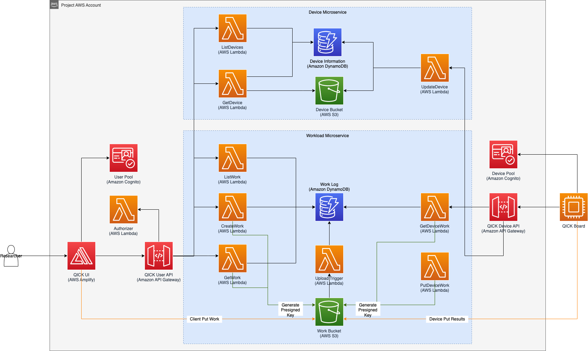
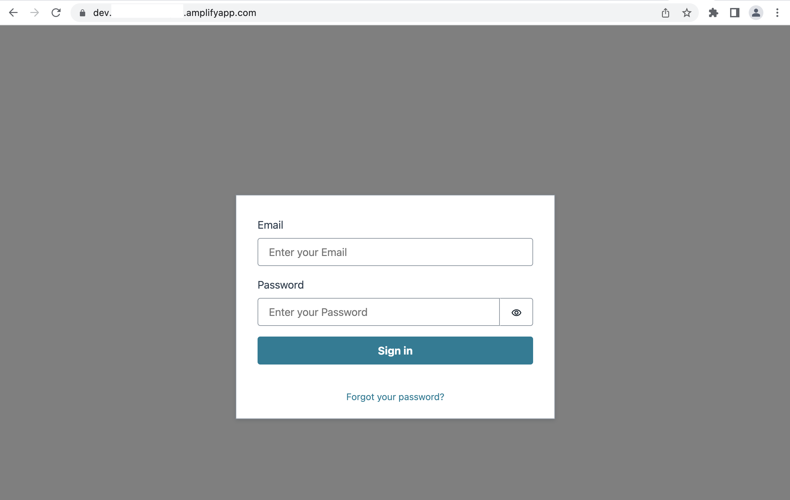
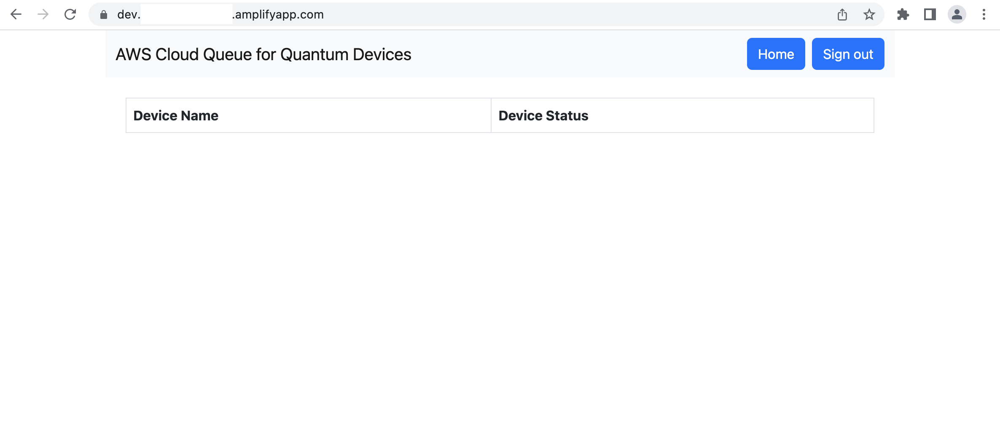

# Cloud Queue for Quantum Devices

## Overview
Cloud Queue for Quantum Devices is a cloud-based application which allows quantum researchers to easily and securely submit and manage workloads destined for quantum devices, from anywhere in the world. 

Researchers will primarily use this application through a web interface -- using any modern web browser. Once deployed, administrators create user accounts for researchers, which then will be used to access the secure web interface. Administrators will also integrate the quantum devices with the application which will provide researchers the ability to submit workloads to  devices. Once logged in, researchers can view the queues they have access to, view the characteristics of the device attached to the queue, submit experiments, view and manage their queued experiments, and retrieve results once competed. The QICK project has implemented client code, available in their GitHub repo, which uses this application's API. This project was developed in collaboration with the QICK community, for which we are very grateful.

## Architecture
This application comprises a set of [AWS Serverless](https://aws.amazon.com/serverless/) services. Serverless has the benefits of 1) having no servers to manage, 2) pay-for-value pricing model, 3) continuously scaling, as well as 4) built-in fault tolerance. Below are the specific services used and in what capacity:

- [Amazon Cognito](https://aws.amazon.com/cognito/) - access management for the web interface and APIs
- [Amazon API Gateway](https://aws.amazon.com/api-gateway/) - APIs that are used to create and manage workloads and devices
- [Amazon S3](https://aws.amazon.com/s3/) - storage of device and workload metadata, as well as workload results
- [AWS Amplify](https://aws.amazon.com/amplify/) - set of tools and services to aid rapid software development and deployment
- [Amazon DynamoDB](https://aws.amazon.com/dynamodb/) - real-time queuing of workloads, as well as available devices
- [AWS Lambda](https://aws.amazon.com/lambda/) - business logic for managing workloads and devices

Below is the visual representation, as well relationships, of the services mentioned above:


## Let's Get Started!

## Prerequisites
- [AWS CLI](https://docs.aws.amazon.com/cli/latest/userguide/cli-chap-getting-started.html): `aws --version` (2.x)
- [Node.js](https://nodejs.org/en/download/): `node --version` (16.x)
- [jq](https://stedolan.github.io/jq/): jq --version

## Setup

1. Login or [Create](https://portal.aws.amazon.com/billing/signup?type=enterprise#/start) an AWS Account.
2. In a terminal, clone this repo and change into the directory.
3. Install the [Amplify CLI](https://github.com/aws-amplify/amplify-cli) and application dependencies.
```
npm install -g @aws-amplify/cli
npm install
```
3. If it’s your first time using the CLI, you will need to configure it by running `amplify configure`. Follow the instructions to create an IAM profile locally.
4. Now let’s initialize an Amplify project in this directory. `amplify init`

```
$ amplify init
? Enter a name for the environment  dev
? Choose your default editor: (pick an editor)
? Do you want to use an AWS profile? Y (this should be the profile you created in step #4)
```

5. To deploy the application (include the UI) to the cloud, run `amplify push`, then `amplify publish`.

6. For some of the subsequent commands, you need to set some specific environment variables. Run the following commands:
```
export AWS_REGION=$(jq -r '.providers.awscloudformation.Region' ./amplify/#current-cloud-backend/amplify-meta.json)
export COGNITO_USER_POOL_ID=$(jq -r '.auth[(.auth | keys)[0]].output.UserPoolId' ./amplify/#current-cloud-backend/amplify-meta.json)
export OAUTH2_ENDPOINT=$(jq --arg AWS_REGION "$AWS_REGION" -r '"https://" + .auth[(.auth | keys)[0]].output.HostedUIDomain + ".auth." + $AWS_REGION + ".amazoncognito.com"' ./amplify/#current-cloud-backend/amplify-meta.json)
export COGNITO_URL="https://cognito-idp.$AWS_REGION.amazonaws.com/"
export CLIENT_ID=$(jq -r '.auth[(.auth | keys)[0]].output.AppClientIDWeb' ./amplify/#current-cloud-backend/amplify-meta.json)
export API_ENDPOINT=$(jq -r '.custom.qickworkloadapi.output.RootUrl' ./amplify/#current-cloud-backend/amplify-meta.json)
```
7. Now, you will create an Admin user to access the UI and the APIs. Replace <username> with your email address. Run the following commands:
```
aws cognito-idp admin-create-user --user-pool-id $COGNITO_USER_POOL_ID --username <username> --user-attributes Name="email",Value="<username>" Name="given_name",Value="<fullname>"

aws cognito-idp admin-add-user-to-group --user-pool-id $COGNITO_USER_POOL_ID --username <username> --group-name Admin
```
8. You will receive an email with a temporary password for the initial login.

9. Now sign into the UI! You can retrieve the URL by running the following command:
```
amplify hosting status
```

10. Open a browser and access the URL. Provide the username (email address) and temporary password to login. On the following screen, you will provide a new password for ongoing use.


11. After setting your new password, you should see the Cloud Queue for Quantum Devices UI Portal.


12. For the integrations listed below, here is a helpful command to print relevant information:

```
printf '%s\n' \
    "COGNITO_USER_POOL_ID=$COGNITO_USER_POOL_ID" \
    "COGNITO_URL=$COGNITO_URL" \
    "CLIENT_ID=$CLIENT_ID" \
    "OAUTH2_ENDPOINT=$OAUTH2_ENDPOINT" \
    "API_ENDPOINT=$API_ENDPOINT"
```

## Integrations
- ### [SideQICK](https://github.com/openquantumhardware/qick/tree/main/aws)
    SideQICK is a Python-based library and CLI that can used to integrate with Cloud Queue for Quantum Devices. The library provides the ability to pull workloads off of the queue, process them, and submit results back for reseachers to consume via the web interface.

## Running the UI locally

1. `npm run start`
2. The app should run on http://localhost:3000/.

## Security

See [CONTRIBUTING](CONTRIBUTING.md#security-issue-notifications) for more information.

## License

This library is licensed under the MIT-0 License. See the LICENSE file.
